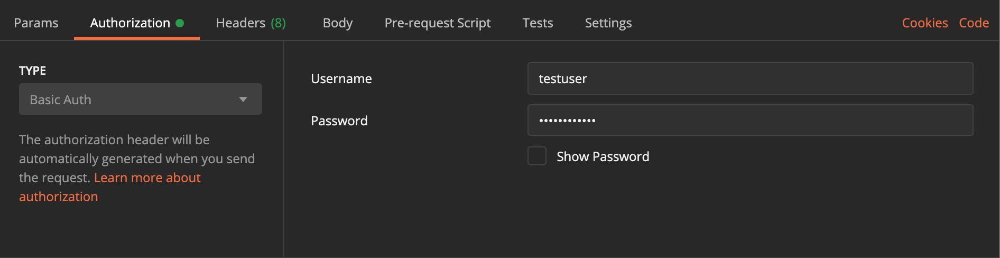

# django_rest_api

Python CRUD REST API test task solution.


### SETUP 

```
git clone https://github.com/kamolliddin/django_rest_api.git
pipenv shell
pipenv install
cd crud_app/
python manage.py migrate
python manage.py runserver

POST -> http://127.0.0.1:8000/registration/
REQUEST_BODY {“username":"testuser", "password1":"testpassword", "password2":"testpassword"}
!! You can change testuser and testpassword to any other value !!
```

#### !! NOTE !! AUTH 
For each request you have to provide username (testuser) and password (testpassword) from above step:




### ENDPOINTS: (POSTMAN)

#### PRODUCT
```
GET -> http://127.0.0.1:8000/api/getproducts
GET -> http://127.0.0.1:8000/api/getproduct/ID

POST -> http://127.0.0.1:8000/api/addproduct
REQUEST_BODY{
name: text
title: text
price: number
image: file
}

PUT -> http://127.0.0.1:8000/api/updateproduct/ID
REQUEST_BODY{
name: text
title: text
price: number
image: file
}

DELETE -> http://127.0.0.1:8000/api/deleteproduct/ID
```

#### USER
```
GET -> http://127.0.0.1:8000/api/getusers
GET -> http://127.0.0.1:8000/api/getuser/ID

POST -> http://127.0.0.1:8000/api/adduser
REQUEST_BODY{
name: text
email: email
}

PUT -> http://127.0.0.1:8000/api/getuser/ID
REQUEST_BODY{
name: text
email: email
}

DELETE -> http://127.0.0.1:8000/api/deleteuser/ID
```


